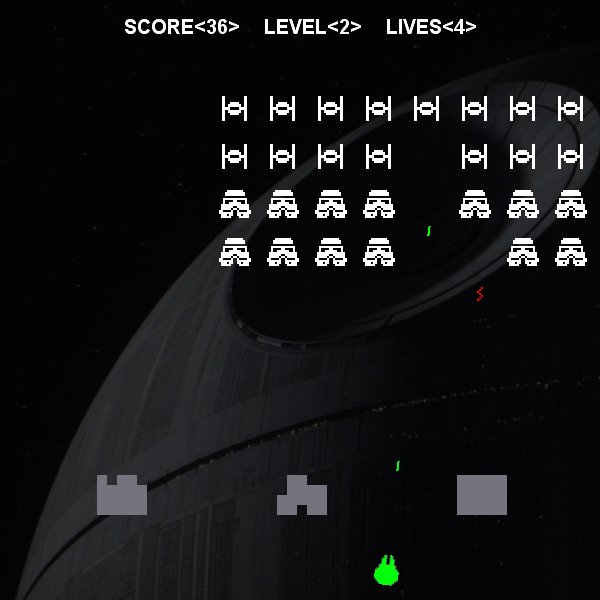

# Cosmic-Conquistadors
A game similar to Space Invaders developed for Computer Science E214 (Sellenbosch University)

## Compilation and execution
Compile and run the Invaders.java file.

### Interface inheritance
The declared interface is contained in Critter.java. This interface is implemented by DefaultCritter.java.

### Class inheritance
The classes Enemy, Turret, Shooter, Bunker and Missile extend the class DefaultCritter. Of these classes Turret and Enemy modify the behaviour of DefaultCritter to include a recharge variable, so that they have a delay to their firing. Bunker then also modifies the standard collision code so that it is destructible in stages, rather than that the entire bunker would be destroyed instantaneously, as with normal DefaultCritter objects.
